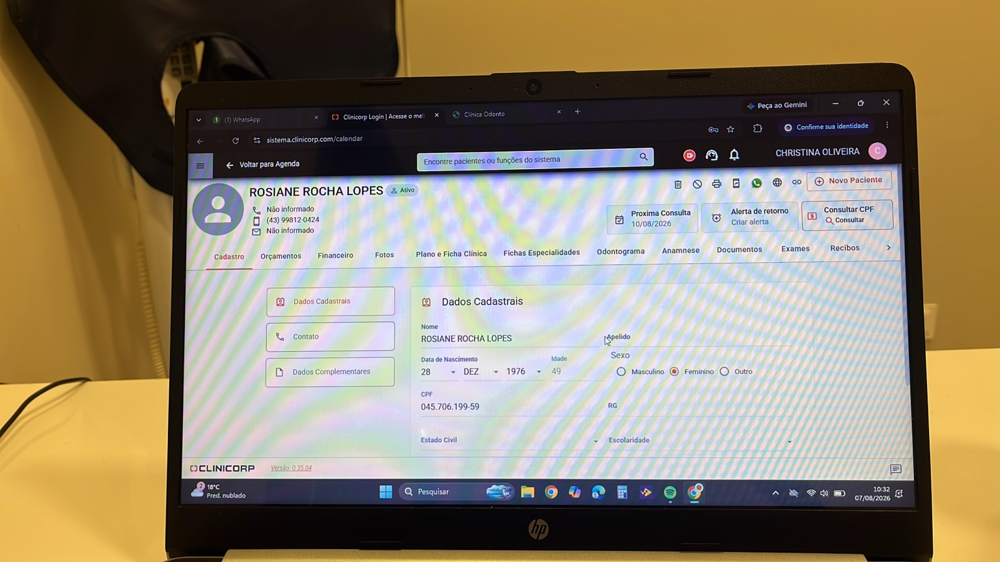
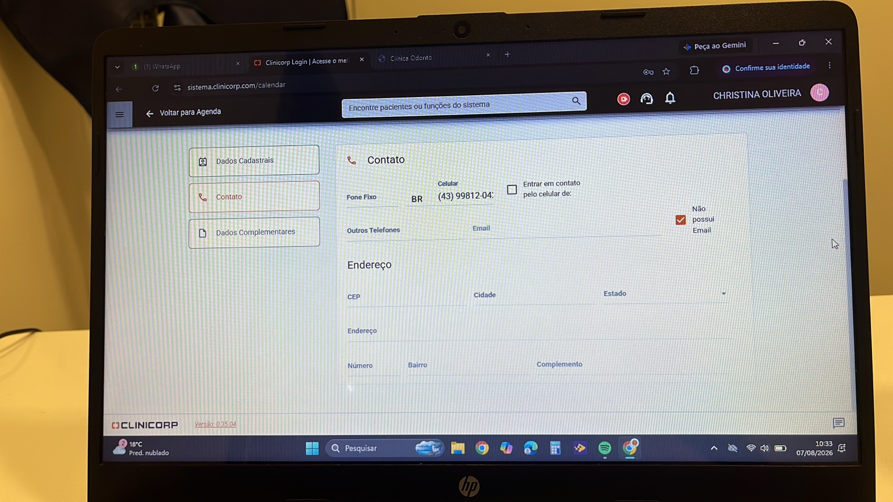
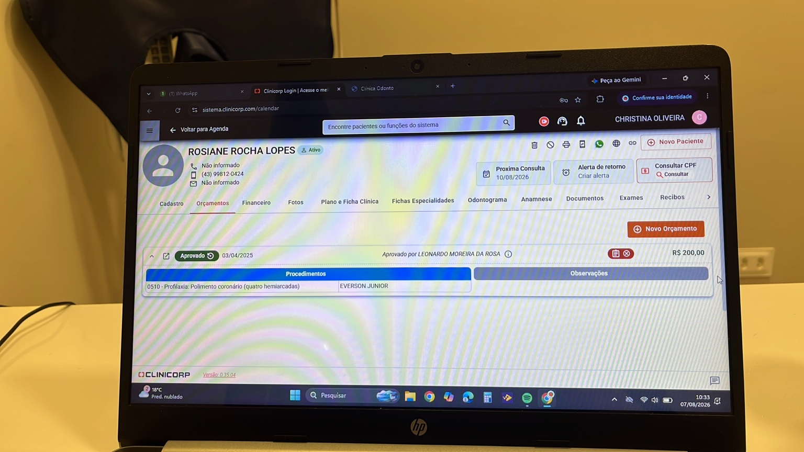
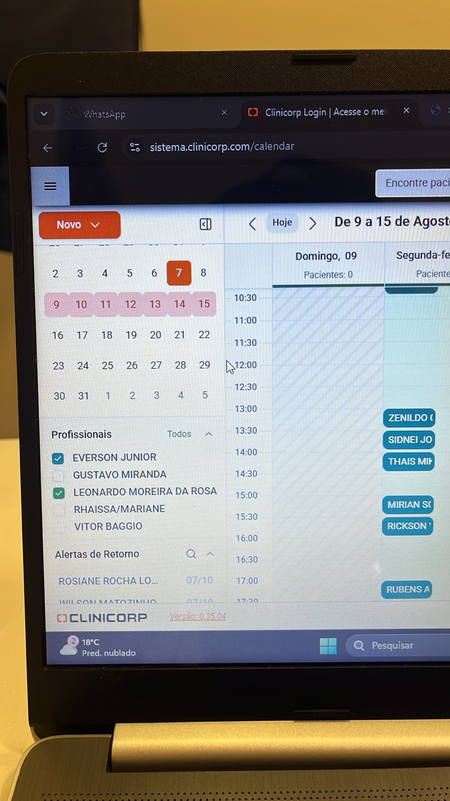
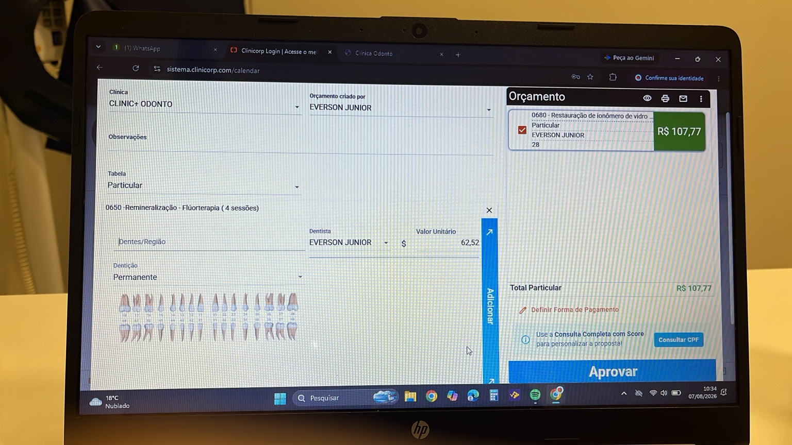
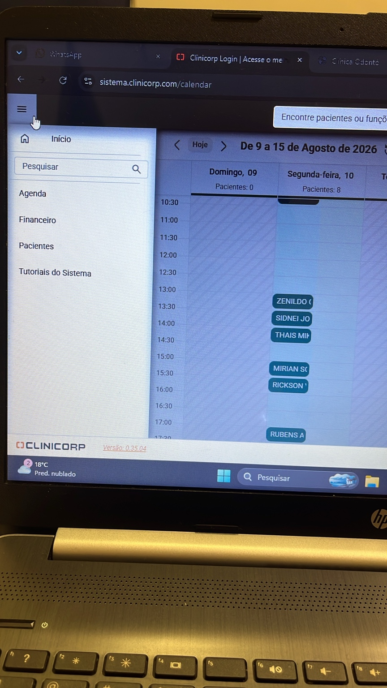
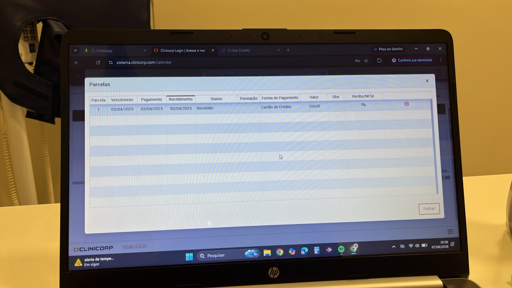
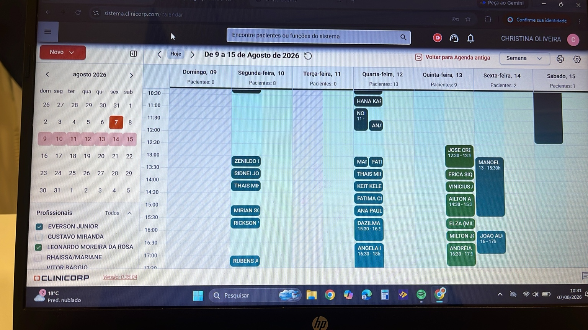
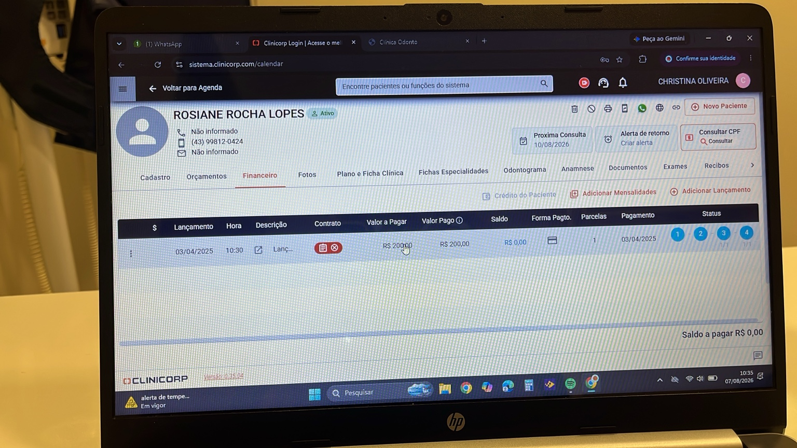
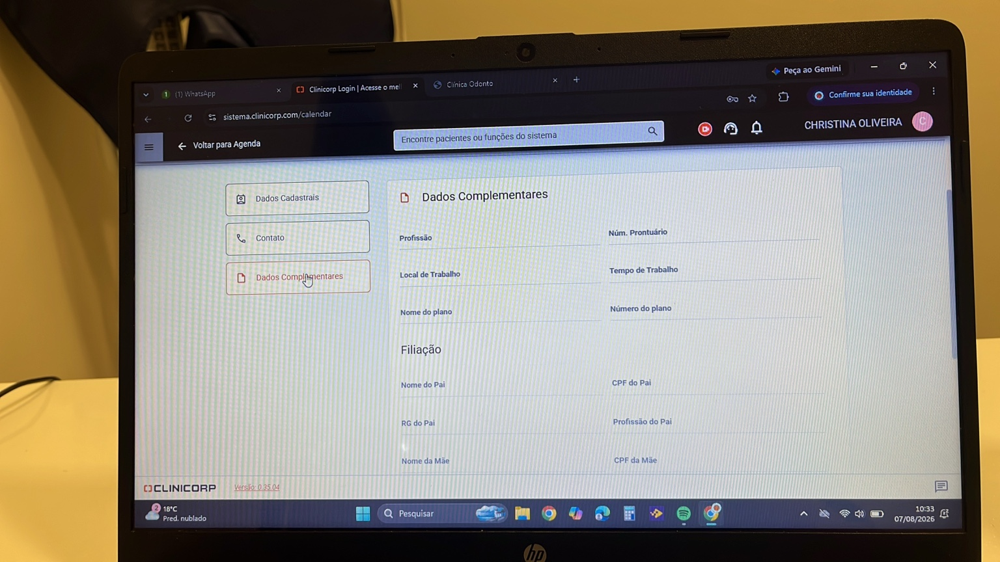

# BusinessOS Odonto - Referências Visuais
Este documento reúne as telas de referência do sistema analisado.

---

## Tela 1

**Objetivo:** Descrever posteriormente a funcionalidade desta tela.

---

## Tela 2

**Objetivo:** Descrever posteriormente a funcionalidade desta tela.

---

## Tela 3

**Objetivo:** Descrever posteriormente a funcionalidade desta tela.

---

## Tela 4

**Objetivo:** Descrever posteriormente a funcionalidade desta tela.

---

## Tela 5

**Objetivo:** Descrever posteriormente a funcionalidade desta tela.

---

## Tela 6

**Objetivo:** Descrever posteriormente a funcionalidade desta tela.

---

## Tela 7

**Objetivo:** Descrever posteriormente a funcionalidade desta tela.

---

## Tela 8

**Objetivo:** Descrever posteriormente a funcionalidade desta tela.

---

## Tela 9

**Objetivo:** Descrever posteriormente a funcionalidade desta tela.

---

## Tela 10

**Objetivo:** Descrever posteriormente a funcionalidade desta tela.

---

## Tela 11

**Objetivo:** Descrever posteriormente a funcionalidade desta tela.

---

## Tela 12

**Objetivo:** Descrever posteriormente a funcionalidade desta tela.

---

## Tela 13

**Objetivo:** Descrever posteriormente a funcionalidade desta tela.

---

## Tela 14

**Objetivo:** Descrever posteriormente a funcionalidade desta tela.

---

## Tela 15

**Objetivo:** Descrever posteriormente a funcionalidade desta tela.

---

## Tela 16

**Objetivo:** Descrever posteriormente a funcionalidade desta tela.
