# BusinessOS Odonto — Padrão Visual Oficial

Este documento reúne as **imagens de referência enviadas pelo usuário** e define o padrão visual obrigatório do sistema.

> **Regra:** estas imagens não são inspiração de cores. São a **fonte de composição e layout**. A identidade oficial atual é o **tema escuro**.

As imagens em `imagens/` definem estrutura, hierarquia e distribuição dos blocos. A implementação deve reproduzir essa composição em **azul-marinho profundo + azul vivo + branco**.

---

## Identidade visual

Todas as telas devem seguir:

- fundo azul-marinho muito escuro (`#05080f`);
- cards e superfícies em azul profundo (`#0b121e`);
- textos principais em branco (`#f8fbff`);
- textos secundários em cinza-azulado (`#94a3b8`);
- bordas discretas (`#1a2d45`);
- **azul vivo** (`#0066ff`) para ações, links e item ativo;
- verde, laranja e vermelho **apenas** para status;
- ícones finos e modernos;
- cantos levemente arredondados;
- aparência de SaaS profissional.

Sidebar, páginas, cards e tabelas pertencem ao **mesmo tema escuro**. Não existe superfície branca como padrão do produto.

### Não usar

- roxo como cor principal;
- fundo branco / cinza claro como identidade do produto;
- sidebar diferente em cada página;
- gradientes exagerados;
- excesso de elementos decorativos.

---

## Navegação principal (sidebar)

Somente estes 6 itens:

1. Painel
2. Agenda
3. Pacientes
4. Relatórios
5. Comunicações
6. Configurações

**Não** colocar na sidebar principal: Tratamentos, Orçamentos, Financeiro, Odontograma, Prontuário, Estoque.

Esses módulos ficam no **contexto do paciente** ou em rotas internas.

---

## Referências por tela

As imagens abaixo definem **composição**. Cores da implementação: claras.

### 1. Painel

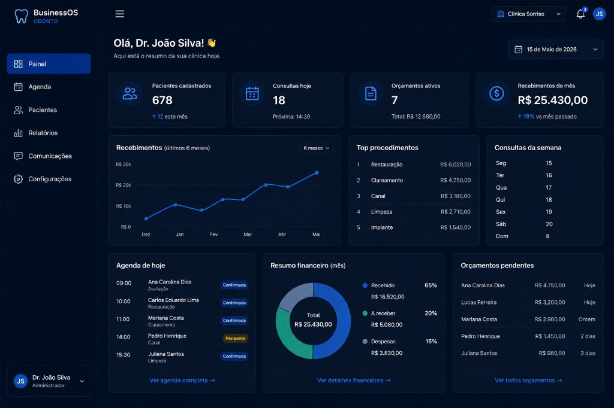

- KPIs no topo (pacientes, consultas, orçamentos, recebimentos)
- Gráfico de recebimentos (6 meses)
- Top procedimentos, consultas da semana
- Agenda do dia, resumo financeiro, orçamentos pendentes

---

### 2. Agenda

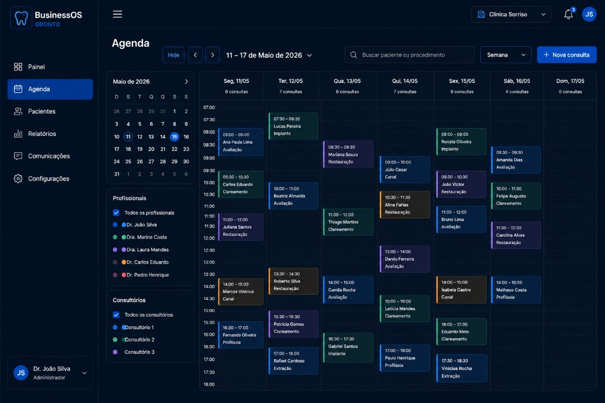

- Mini calendário e filtros (profissionais, consultórios)
- Visão semanal com grade de horários
- Cards de consulta coloridos por profissional
- Busca, seletor de visão e botão **Nova consulta**
- Fundo escuro, grade discreta, texto branco

---

### 3. Pacientes

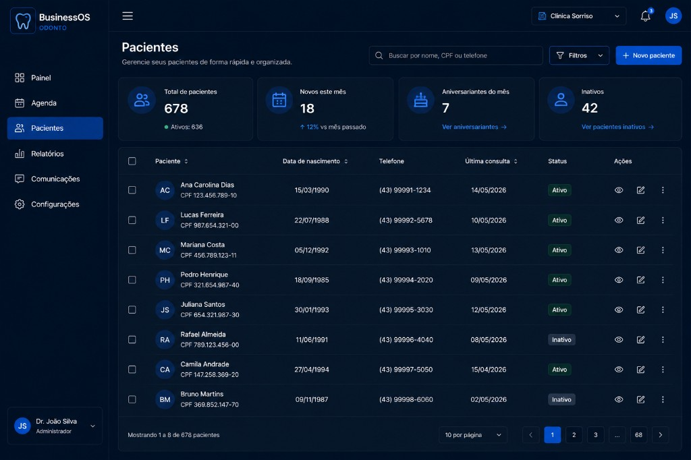

- Título, descrição, busca, filtros, **Novo paciente**
- Cards de resumo (total, novos, aniversariantes, inativos)
- Tabela com avatar, CPF, telefone, última consulta, status e ações
- Paginação

---

### 4. Relatórios

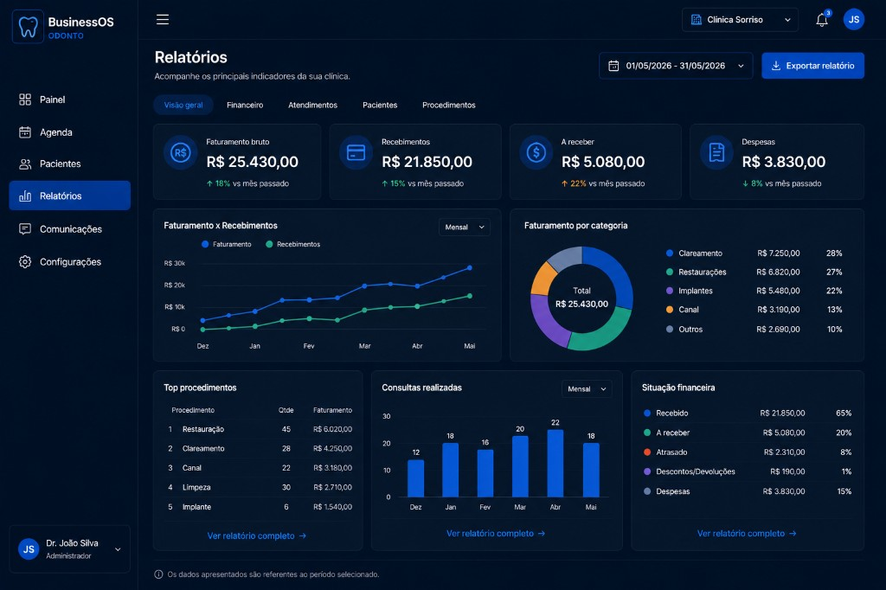

- KPIs financeiros (faturamento, recebimentos, a receber, despesas)
- Gráficos: faturamento x recebimentos, faturamento por categoria
- Top procedimentos, consultas realizadas, situação financeira
- Abas: Visão geral, Financeiro, Atendimentos, Pacientes, Procedimentos

---

### 5. Configurações

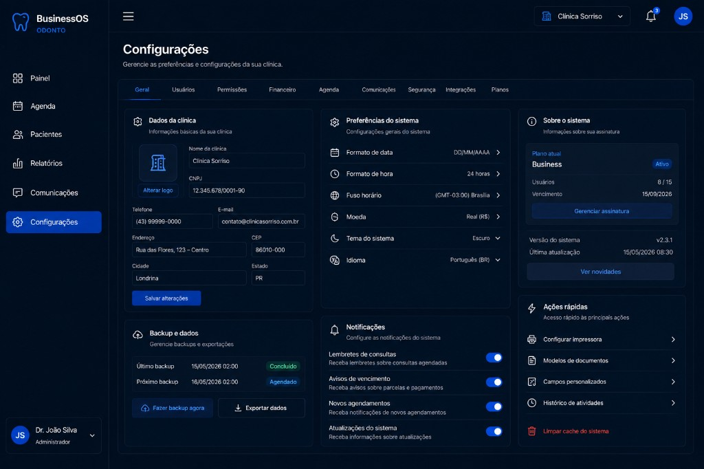

- Categorias: Geral, Usuários, Permissões, Financeiro, Agenda, Comunicações, Segurança, Integrações, Planos
- Cards: Dados da clínica, Preferências, Sobre o sistema, Backup, Notificações, Ações rápidas

---

### 6. Comunicações

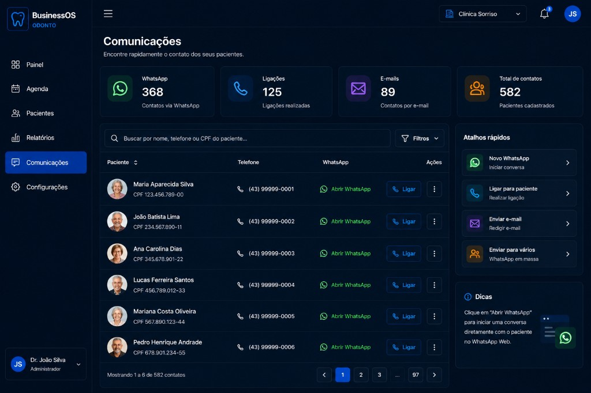

- Lista de contatos dos pacientes (não é chat interno)
- Cards de resumo (WhatsApp, ligações, e-mails, total)
- Busca, tabela com telefone, link WhatsApp, botão **Ligar**
- Atalhos rápidos e dicas

---

## Ficha do paciente

### 7. Resumo do paciente

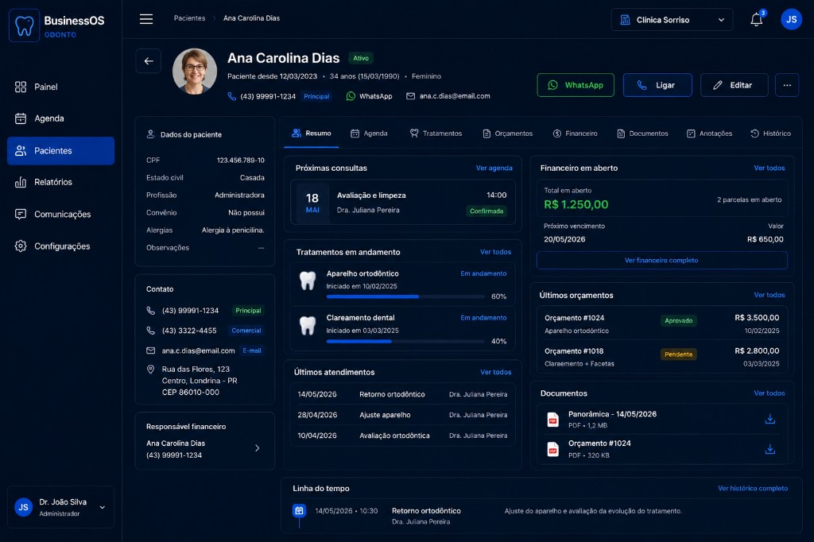

**Cabeçalho:**

- avatar/foto, nome, status, CPF
- telefone, WhatsApp, e-mail
- data de nascimento, próxima consulta, alerta de retorno, consultar CPF
- botões: WhatsApp, Ligar, Editar

**Abas:** Resumo, Agenda, Tratamentos, Orçamentos, Financeiro, Documentos, Anotações, Histórico

---

### 8. Agenda do paciente

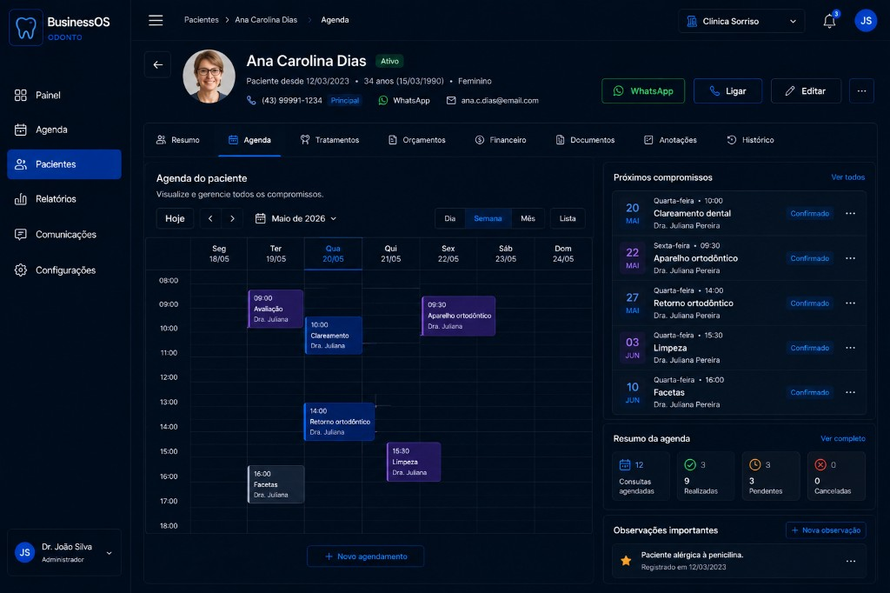

- Calendário semanal do paciente
- Próximos compromissos, resumo da agenda, observações importantes

---

### 9. Tratamentos do paciente

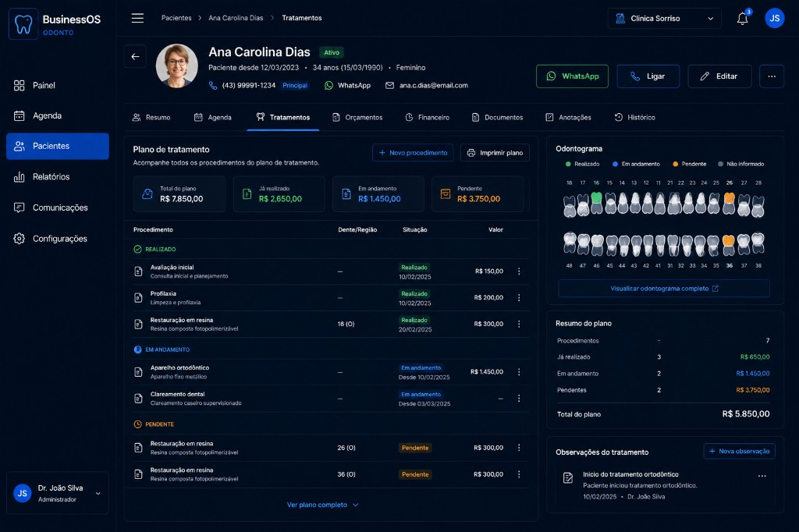

- Plano de tratamento com cards: total, realizado, em andamento, pendente
- Tabela de procedimentos por status (REALIZADO, EM ANDAMENTO, PENDENTE)
- Odontograma lateral, resumo do plano, observações

---

### 10. Detalhe do orçamento (paciente)

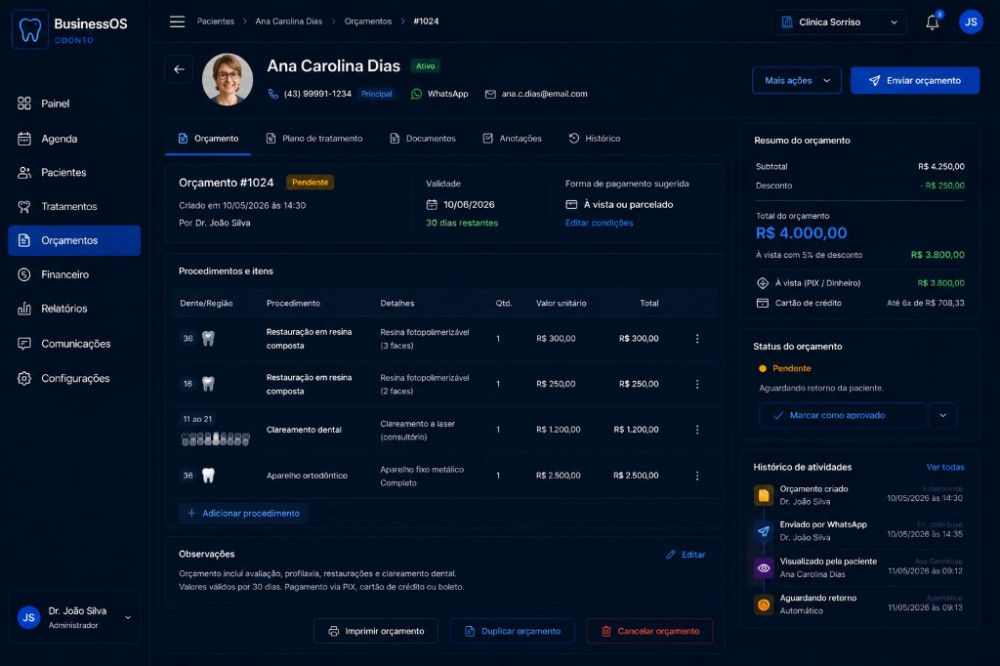

- Orçamento #1024 com status, validade, forma de pagamento
- Tabela de procedimentos (dente, procedimento, qtd, valores)
- Resumo lateral (subtotal, desconto, total)
- Histórico de atividades

---

### 11. Novo orçamento (fullscreen)

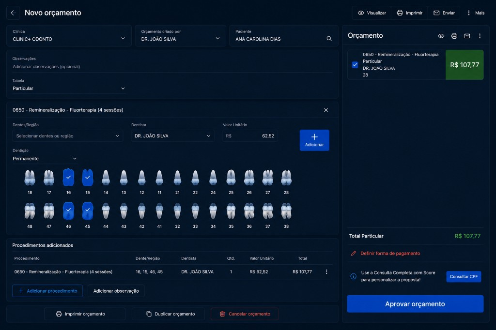

- Tela **quase fullscreen**, sem sidebar principal
- Paciente, clínica, profissional, tabela, observações
- Seleção de dentes com odontograma interativo
- Resumo do orçamento à direita
- **Aprovar orçamento** / definir forma de pagamento

> Referência de fluxo inspirada no Clinicorp, adaptada à identidade BusinessOS Odonto.

---

### 12. Financeiro do paciente

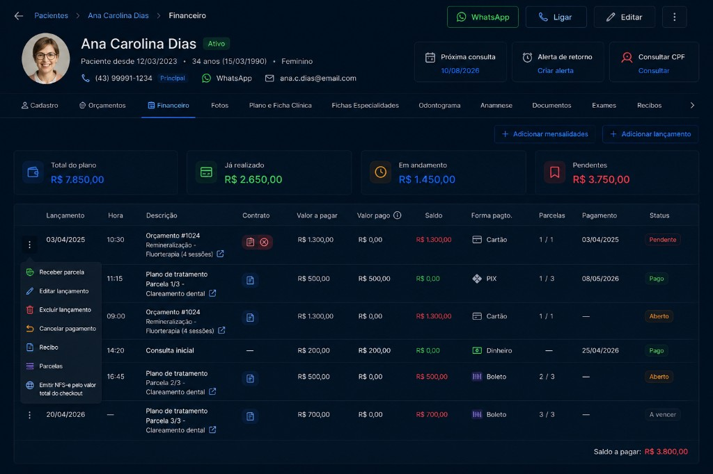

**Resumo:** total do plano, já realizado, em andamento, pendentes

**Tabela:** lançamentos, valor a pagar, valor pago, saldo, forma de pagamento, parcelas, pagamento, status

**Menu ⋮ de cada lançamento:**

- Receber parcela
- Editar lançamento
- Excluir lançamento
- Cancelar pagamento
- Recibo
- Parcelas
- Emitir NFS-e

---

## Regra de consistência

Se um componente aparece em várias imagens, deve ser o **mesmo componente visual**:

| Elemento | Deve ser igual em todas as telas |
|---|---|
| Botões | mesmo estilo |
| Cards | mesmo estilo |
| Tabelas | mesmo estilo |
| Cabeçalho do paciente | mesmo estilo |
| Sidebar | mesma sidebar |
| Cores | mesmos tokens |
| Espaçamentos | mesmos tokens |
| Tipografia | mesma hierarquia |

---

## Arquivos de imagem

| Arquivo | Tela |
|---|---|
| `imagens/01-painel.png` | Painel |
| `imagens/02-agenda.png` | Agenda |
| `imagens/03-pacientes.png` | Pacientes |
| `imagens/04-relatorios.png` | Relatórios |
| `imagens/05-configuracoes.png` | Configurações |
| `imagens/06-comunicacoes.png` | Comunicações |
| `imagens/07-paciente-resumo.png` | Paciente — Resumo |
| `imagens/08-paciente-agenda.png` | Paciente — Agenda |
| `imagens/09-paciente-tratamentos.png` | Paciente — Tratamentos |
| `imagens/10-paciente-orcamento-detalhe.png` | Paciente — Orçamento |
| `imagens/11-novo-orcamento-fullscreen.png` | Novo orçamento |
| `imagens/12-paciente-financeiro.png` | Paciente — Financeiro |

---

*Identidade clara definida em 16/08/2026. Imagens de composição originais de 15–16/08/2026.*
